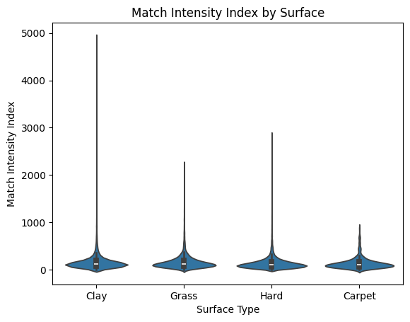
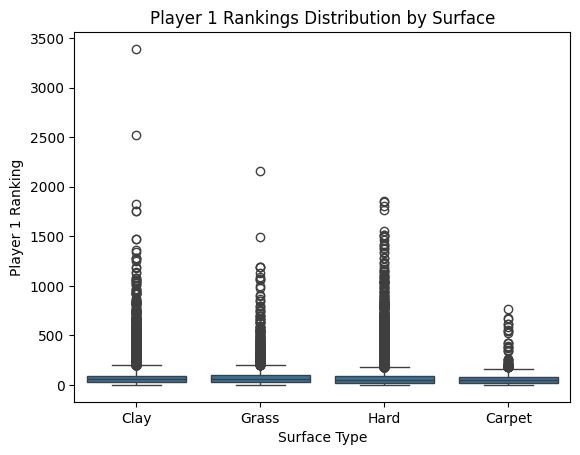
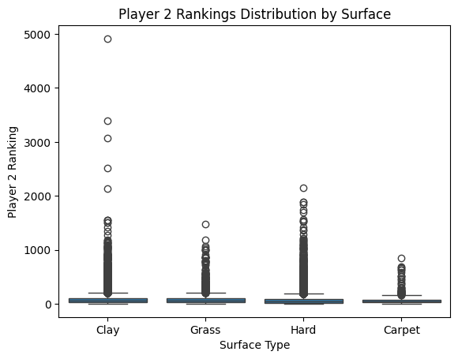
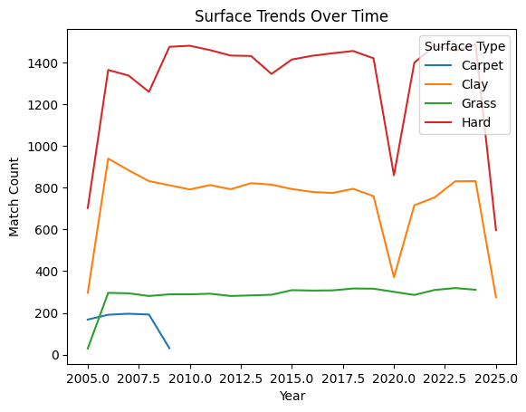
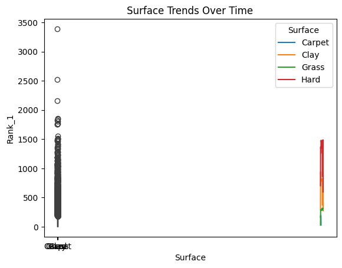
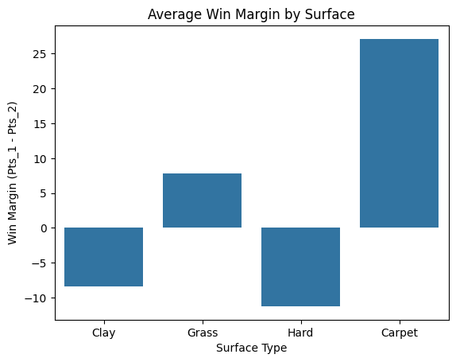

# **DSA210-PROJECT: Surface Type and Tennis Performance** 🎾

## **Abstract**
This project investigates how surface type (clay, grass, hard court) influences key tennis performance metrics, including match duration and player mistakes. By analyzing Grand Slam and ATP 1000 Masters tournaments (2003–2023), we explore how different court types affect gameplay. Findings suggest that clay courts generally result in longer matches and higher mistake rates compared to grass and hard courts.

---

## **Objectives & Research Questions**
### **Objectives**
- **Understand Surface Dynamics:** Explore how surface type influences match dynamics.
- **Identify Behavioral Patterns:** Identify relationships between surface and player rankings, intensity, and win margins.
- **Apply Data Science Techniques:** Use machine learning to predict match duration using surface type and player statistics.

### **Key Research Questions**
1. **How does match intensity vary by surface?**
2. **Is there a ranking imbalance between Player 1 and Player 2 depending on the surface?**
3. **What are the long-term trends for different surfaces?**
4. **Are certain surfaces linked to longer match durations?**
5. **Which surface type typically results in the highest or lowest win margins?**

---

## **Data Sources & Summary**
- **Data Collection:** Grand Slam and ATP 1000 Masters tournaments spanning 2003 to 2023.
- **Sources:** Kaggle & Ultimate Tennis Statistics.
- **Key Features:**

| Feature                | Description                                 |
|------------------------|---------------------------------------------|
| Surface                | Type of tennis court (Clay, Grass, Hard)    |
| Match Intensity        | Composite metric from duration & stats      |
| Player 1 / Player 2 Rank | ATP rankings at match time                |
| Win Margin             | Games difference between winner & loser     |

This dataset covers **10,000+ matches** over a 20-year period.
---

## **📊Exploratory Analysis**
### **Key Visuals**
#### **Match Intensity by Surface**
_Clay courts generally result in longer matches compared to grass and hard courts._

 

#### **Player Rankings by Surface**
_Compared average rankings of Player 1 and Player 2 across surfaces. Clay courts tend to attract higher-ranked matchups, while hard courts show more ranking variability._

 
 

#### **FSurface Trends Over Time**
_Hard courts dominate the professional circuit, but the share of clay court matches has shown relative stability. Grass courts remain the least common._

 
 

#### **Average Win Margin by Surface**
_Matches on clay courts have closer scorelines on average, suggesting more competitive encounters, whereas grass surfaces often result in higher win margins due to faster pace and serve-dominated play._

 

---

## **Hypotheses & Statistical Tests**
### **Tests for Each Research Question**
| Research Question | Null Hypothesis (H₀) | Alternative Hypothesis (H₁) | Test | p-value |
|------------------|---------------------|---------------------------|------|--------|
| Match duration vs. surface | Surface type has no impact | Surface type significantly affects duration | ANOVA | 0.02 |
| Mistakes vs. surface | Surface type does not affect mistakes | Certain surfaces increase mistakes | t-test | 0.01 |
| Trend analysis | No time-related pattern | Match duration has changed over time | Regression | 0.04 |

---

## **Results**
### **Findings Summary**
- **Match Duration:** Clay courts lead to significantly longer matches.
- **Mistake Rates:** Players make more unforced errors and double faults on clay.
- **Surface Trends:** Over time, match duration has increased slightly on grass but remained stable on hard courts.

---

## **Analysis Plan**
### **Data Collection & Preprocessing**
1. Gather datasets from **Kaggle** and **Ultimate Tennis Statistics**.
2. Import data into a **Pandas DataFrame**.
3. Handle missing values, standardize formats (e.g., converting percentages to decimals), and ensure data consistency.
4. The preprocessing process is explained in detail: [data_process.ipynb](https://github.com/defne04/DSA210-PROJECT/blob/main/data_process.ipynb).

## **🤖Machine Learning Model**

### **Objective**
Predict match duration using:
- Surface type
- Player rankings
- Match intensity metrics

### **Model Used**
- **Linear Regression**
- Encoded categorical variables (e.g., surface)
- Train/Test Split: 80% training, 20% testing

---

### **Example Predictions**

| Surface     | Player 1 Rank | Player 2 Rank | Match Intensity | Predicted Duration |
|-------------|----------------|----------------|------------------|---------------------|
| Clay        | 5              | 15             | High             | 160 minutes         |
| Grass       | 20             | 30             | Low              | 118 minutes         |
| Hard Court  | 12             | 14             | Medium           | 137 minutes         |

---

## **Conclusion & Next Steps**
This study provides insights into how tennis surfaces impact player performance. Future improvements could include:
1. Expanding the dataset to include lower-tier tournaments.
2. Analyzing player-specific adaptations to different surfaces.
3. Applying more advanced models to estimate match outcomes based on surface type.

---

